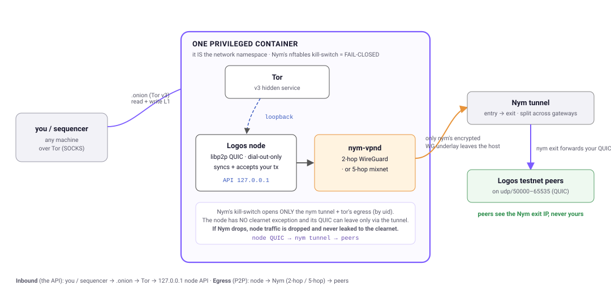

# Diaphani

Run a [Logos](https://logos.co) testnet node that **links you to no one**** and reach it **anonymously** from your sequencer.

Diaphani runs a Logos cryptarchia testnet node and routes its traffic so **no Logos peer
(or your ISP) can see your IP**, they only ever see a Nym exit IP shared by many users. It
serves the node's API as a Tor `.onion` with **no open ports**, and ships a Rust SDK
(`diaphani-client`) so a **sequencer** can read and write Logos L1 through that `.onion`.



Everything runs in **one privileged Docker container** that ships the node, Nym, and Tor so
it runs the same on any (Linux) box.

---

## For hosts: set up a node

You need three things:

1. **A Linux host with Docker**: (the CLI installs Docker on Debian/Ubuntu; or use any host that already has it).
2. **A NymVPN subscription**: your 24-word secret phrase. Pay in Monero (XMR) at <https://nym.com>. Diaphani will store it in an encrypted, password-protected file.
   ⚠️ One node per subscription (Nym allows one active session per account).
3. **A custom Logos testnet peer (optional)** to sync from, a multiaddr on a Nym-allowed udp port
   (50000–65535). A known-good one is **built in**, so you can leave `setup`'s peer prompt as-is;
   override it any time (ask the Logos team on Discord for a current peer, or set
   `BOOTSTRAP_PEERS="…"`).

```sh
# STEP 1. install the CLI (this installs Node.js too if you don't have it)
curl -fsSL https://raw.githubusercontent.com/paradoxcomputer/diaphani/main/install.sh | sh

#    …or, if you already have Node ≥ 18:   
npm install -g @paradoxcomputer/diaphani

# STEP 2. set it up (asks for your Nym phrase, a peer, and your privacy mode)
diaphani setup

# STEP 3. bring it online + watch it sync
diaphani up                  # prints your node's .onion address
diaphani status --follow
```

That's it! `diaphani up` prints the `.onion` your tools will reach the node at.

**Privacy mode** (picked once in `setup`):

- **fast → 5-hop** *(recommended)* — sync fast on 2-hop WireGuard, then the container
  auto-switches to the 5-hop mixnet once the node is caught up. The best balance: quick sync,
  then strongest privacy.
- **fast → fast** — always 2-hop WireGuard. Hides your IP at the lowest latency; best for a
  block-producing node. No timing-attack resistance.
- **5-hop → 5-hop** — always the 5-hop Sphinx mixnet. Strongest privacy and timing resistance,
  but seconds of latency — best for a passive follower node.

Other commands: `diaphani logs -f` (watch the node), `diaphani down` (stop it),
`diaphani clientauth <name>` (authorize a client, see below). Run `diaphani --help` for all
of them.

---

## For clients: set up a sequencer

A "sequencer" here is **your own program** that talks to L1 and reads chain state and submits
signed transactions. `diaphani-client` is a **Rust library** you add to that program; it carries
your requests to the node over Tor, so your service never learns the node's IP. It **does not
hold keys or sign** — you give it a transaction you already signed and it relays it.

**What `diaphani-client` gives you:**

- **Read L1 over Tor** — `info` (tip / height / sync mode), `blocks`, `headers`, `lib_stream`
  (finality), `network_info`, `mempool_metrics`, `wallet_balance`, plus `get` / `get_json` for
  any endpoint.
- **Write L1** — `submit_tx` broadcasts your already-signed transaction (`post_json` for any
  route); on a reject it surfaces the node's *actual* reason, not an opaque HTTP status.
- **You keep your keys** — the client never signs or holds keys. The node's own-wallet
  `transfer_funds` (the *node* signs) is gated behind an opt-in `node-wallet` cargo feature.
- **Fail-closed transport** — every request goes through Tor (`socks5h`, the proxy resolves the
  `.onion`) with **no direct-connect fallback** and a `.onion`-only guard, so a misconfig or a
  dead proxy *errors* instead of leaking to the clearnet.
- **Built for unattended services** — size-capped responses (a bad node can't OOM you), read
  retries with backoff (**writes never retry**, so a tx is never double-broadcast), a connect
  timeout, and `wait_until_online()` so you never submit against a half-synced node.
- **(optional)** — the `forward` tool
  (`cargo run -p diaphani-forward -- --onion <addr>.onion`) opens a local TCP port that relays to
  the `.onion` over Tor, so existing tooling can point at `127.0.0.1`.

Get the prerequisites, then either **(A)** run the ready-made example in two minutes, or **(B)**
build your own sequencer from an empty project.

### Prerequisites (for both paths)

1. **Rust** — if you don't have it:
   `curl --proto '=https' --tlsv1.2 -sSf https://sh.rustup.rs | sh` (then restart your shell).
2. **A Tor SOCKS proxy** on this machine — install the system `tor` package (it listens on
   `127.0.0.1:9050`), or run Tor Browser (`127.0.0.1:9150`). The crate does **not** embed Tor.
3. **The node's `.onion` address** — ask whoever runs the node; `diaphani status` prints it.
4. **Authorization** — the onion is closed by client-auth. The operator runs
   `diaphani clientauth my-sequencer`, which prints one private-key line; install it so *your*
   Tor can open the onion, then reload Tor:
   ```sh
   mkdir -p ~/.tor/onion_auth && chmod 700 ~/.tor/onion_auth
   printf '%s\n' '<the line diaphani printed>' > ~/.tor/onion_auth/diaphani.auth_private
   chmod 600 ~/.tor/onion_auth/diaphani.auth_private
   echo 'ClientOnionAuthDir ~/.tor/onion_auth' | sudo tee -a /etc/tor/torrc
   sudo systemctl reload tor       # Tor Browser: it prompts for the onion key instead
   ```

### A) Try the ready-made example (fastest)

Clone this repo and run the bundled `sequencer` example. It connects, waits for the node to
sync, and prints chain + peer state (it sends no transaction). Replace `<addr>` with the node's
onion:

```sh
git clone https://github.com/paradoxcomputer/diaphani
cd diaphani
DIAPHANI_ONION=<addr>.onion DIAPHANI_SOCKS=127.0.0.1:9050 \
  cargo run -p diaphani-client --example sequencer
```

The example's source is `client/examples/sequencer.rs` — a good file to copy from.

### B) Build your own sequencer from scratch

**1. Create a new Rust program and add the library:**

```sh
cargo new my-sequencer
cd my-sequencer
cargo add tokio --features rt-multi-thread,macros          # async runtime
cargo add serde_json                                       # transactions are JSON
cargo add diaphani-client --git https://github.com/paradoxcomputer/diaphani
```

**2. Replace `src/main.rs`** with this complete, runnable program:

```rust
use diaphani_client::{Client, WaitOnline};

#[tokio::main]
async fn main() -> Result<(), Box<dyn std::error::Error>> {
    // Reads DIAPHANI_ONION (required) + DIAPHANI_SOCKS (optional, default 127.0.0.1:9050).
    let node = Client::from_env()?;

    // Don't act on a half-synced node — wait until it's following the tip.
    println!("waiting for the node to sync…");
    let info = node.wait_until_online(WaitOnline::default()).await?;
    println!("online at height {}", info.height);

    // READ L1:
    let net = node.network_info().await?;
    println!("the node has {} peers", net.n_peers);

    // WRITE L1 — your sequencer builds + signs its own SignedMantleTx, then submits it:
    //   let signed_tx: serde_json::Value = /* your signed transaction */;
    //   let receipt = node.submit_tx(&signed_tx).await?;
    //   println!("submitted: {receipt}");

    Ok(())
}
```

**3. Run it**, pointing it at the node's onion and your Tor SOCKS port:

```sh
DIAPHANI_ONION=<addr>.onion DIAPHANI_SOCKS=127.0.0.1:9050 cargo run
```

You should see it wait for sync, then print the height and peer count — that's a working,
masked L1 client. Now wire your real transaction-signing into the **WRITE** block above.

---

## What it protects you from and what it doesn't

Diaphani's one job is **unlinkability**: stopping any *single* party from tying your real IP to
your node. It is not a full Tor-style anonymity system. Honestly:

**✅ It protects you from**

- **Logos peers logging your IP**: they see the Nym exit IP (shared by many users), never yours.
- **Your ISP / network seeing you run a node**: they see only encrypted Nym/WireGuard traffic.
- **Anyone reaching your node's API over the internet**: it's a Tor `.onion`, no open port,
  with optional client-auth.
- **Global timing correlation**: an adversary watching *both* your uplink and the Nym
  exit→peer link. Fast Mode has no cover traffic; pick the **5-hop mixnet** for timing resistance.

**❌ It does *not* protect you from**

- **Nym's own entry + exit colluding**: in Fast Mode one provider holds both ends. The 5-hop
  mixnet spreads trust across independent mix nodes.
- **A compromised host**, or **paying for Nym with a KYC'd method** (pay with Monero if that matters for you).

---

## Compatibility

**Network: Logos cryptarchia *testnet* only.** As of now Diaphani tracks the testnet at node
**v0.1.2** (the version the container builds and the peers it syncs from). It is **not** for
mainnet or any other network; a later testnet node version may need an update here.

**Operating system — Linux only.** The node runs inside a **privileged Docker container** that
needs the host's nftables + policy routing + a network namespace + outbound UDP 50000–65535, so
it's Linux-only. Tested on Ubuntu; elsewhere it *should* work wherever Docker and a modern
kernel are available, but is unverified:

| System | Status | Notes |
| --- | --- | --- |
| **Ubuntu 22.04 / 24.04** | ✅ **Tested** | The CLI auto-installs Docker; full bring-up verified end-to-end. |
| Debian 12+ / other apt-based | 🟡 Should work | Same apt path — the CLI auto-installs Docker. Unverified. |
| Fedora / RHEL / Arch / openSUSE | 🟡 Likely | Install Docker yourself first (the CLI's auto-install is apt-only); the container itself is identical. Unverified. |
| Any other Linux + Docker | 🟡 Probably | Needs a **privileged** container (nftables + policy routing) and outbound UDP 50000–65535. Unverified. |
| macOS / Windows (Docker Desktop) | ❌ Unsupported | The masking needs a real Linux netns + nftables; Docker Desktop's Linux VM is untested and the privacy guarantees aren't verified there. |

The **`diaphani-client` SDK** (the sequencer side) is just a Rust crate talking to a Tor SOCKS
proxy, so it runs anywhere Rust + Tor do (Linux, macOS, or Windows).

---

## Status

Under active testing by maintainers and the community. **Not ready for production.**

## License

Apache-2.0 OR MIT (dual).
